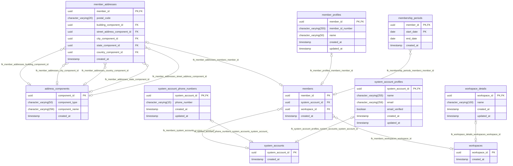

# System Database

## ER図

基本的にはMiroで書いている


### 自動生成

https://github.com/ariga/atlas

以下コマンドでER図のコード（mermaid）をデータベースから生成することができる。

※ただし全てのフィールドがオプショナルになってしまう。

```bash
> make inspect-database
```



### SQLからER図を確認

以下のURLでSQLファイル（001\_create\_tables.sql）からER図を確認できる

https://gh.atlasgo.cloud/explore
